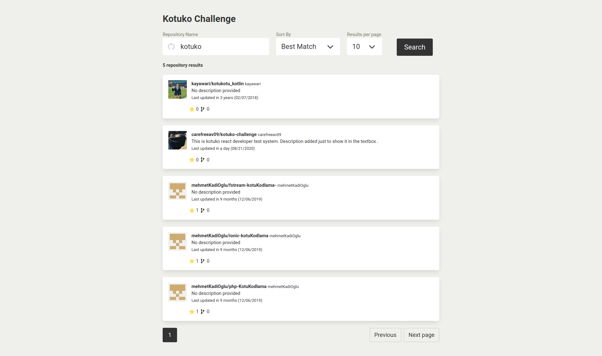
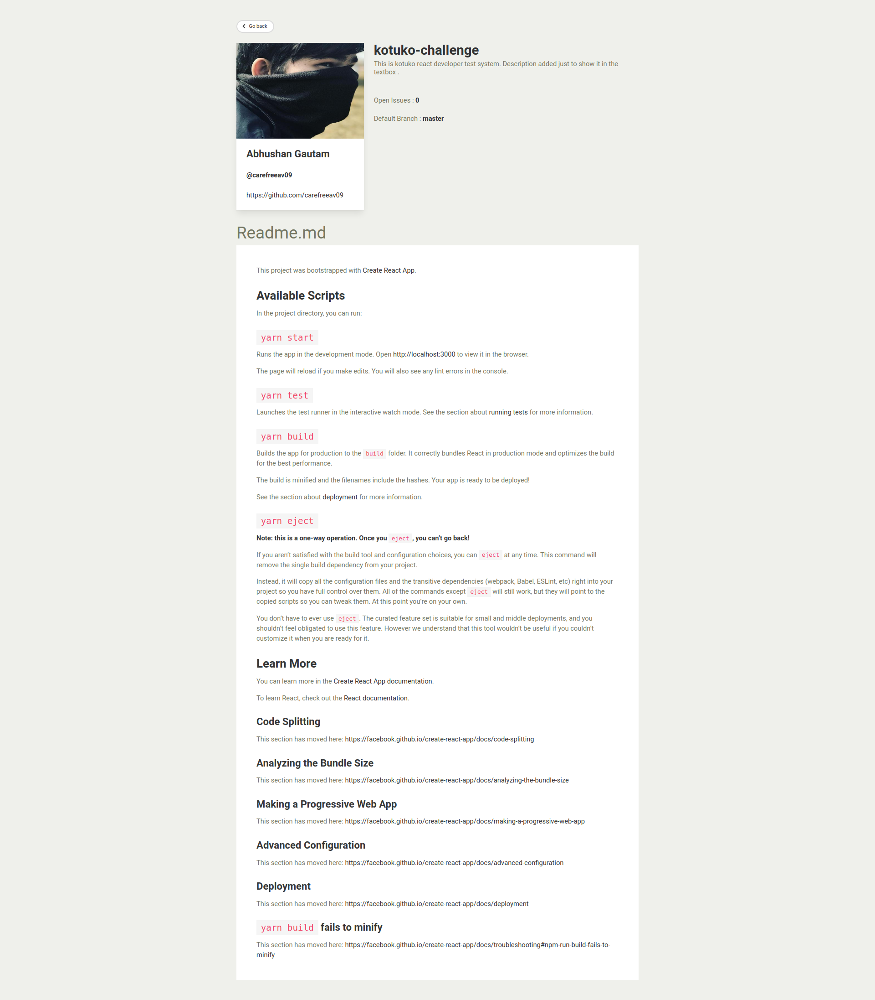

## KOTUKO CHALLENGE

This application uses [Github public APIs](https://docs.github.com/en/rest) to fetch repositories based on search parameters and fetch detail of the respective repository.
 

The project was built with [React](https://reactjs.org/) ( Hooks api ), [Redux](https://redux.js.org/) and CSS is handled by [Bulma](https://bulma.io/) Framework

### Screenshot(s)

Home Page

Detail Page

### Installation and setup instructions

Clone the repository.

##### `git clone git@github.com:carefreeav09/kotuko-challenge.git`

Install the packages

##### `yarn install`

Start the application

##### `yarn start`

Runs the app in the development mode.
Open http://localhost:3000 to view it in the browser.

The page will reload if you make edits.
You will also see any lint errors in the console.

#### Packages Used

1. [React](https://reactjs.org/)
2. [Redux](https://redux.js.org/)
3. [Axios](https://github.com/axios/axios)
4. [React-Redux](https://react-redux.js.org/)
5. [React Markdown](https://www.npmjs.com/package/react-markdown)
6. [Redux Thunk](https://github.com/reduxjs/redux-thunk)
7. [Bulma](https://bulma.io/)
8. [History](https://www.npmjs.com/package/history)
9. [React Router](https://reactrouter.com/web/guides/quick-start)